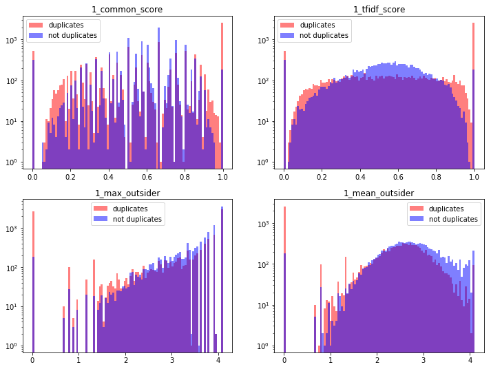
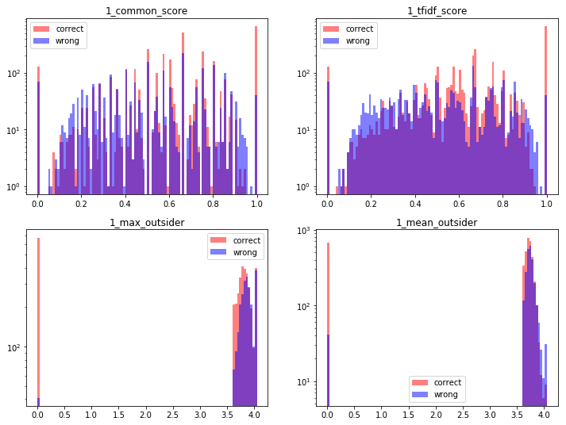
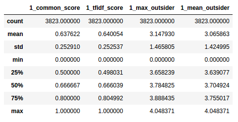
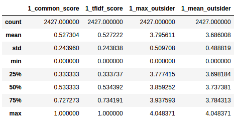
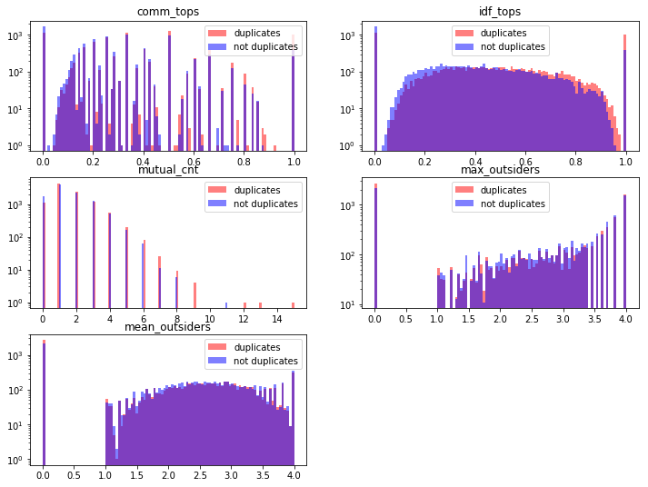

Few years ago, long before Quora Duplicates Competition on Kaggle saw lights of day, Quora hosted its own hackathon. One of tasks was similar in spirit to the one that keeps Kagglers busy - predict whether pair of questions are duplicates. There were some limitations, though - your model had to fit within 1024 MB of memory and run in under 60 seconds. This means that problem was definitely solvable without deep learning approaches. Since I don't have machine to run multiple neural networks, let alone huge ensembles that tend to win Kaggle contests, I will try my best at solving this challenge. It will definitely take me a lot longer than what Quora thought - but I'm not doing this for competition, after all.

Data arrives in format typical for programming contests, atypical for data science contests. We can decipher this fairly simple.

```python
def load_data(input_name):
    
    with open(input_name, 'r') as f:
        T = f.read().split('\n')
        
    Q = int(T[0])
    questions = T[1:Q+1]
    D = int(T[Q+1])
    keys = T[Q+2:Q+2+D]
    to_predict = T[Q+3+D:-1]
    labels = [int(row.split()[2]) for row in keys]
    
    return questions, keys, to_predict, labels

```

Every question has its own, unique key. 

```python
def turn_into_dict_by_keys(questions):
    qdict = {}
    
    for q in questions:
        
        q = json.loads(q)
        key = q.pop('question_key')
        qdict[key] = q
        
    return qdict
```

Then we have to extract sole texts, topics and other features such as view counts and followers count - although I don't expect latter ones to matter much, if at all.

Now for the fun part - modelling. Basic idea would be to examine, how many words from first questions are there in second one and vice versa. Moreover, we would like to have some notion of selectiveness - which would be IDF part from TF-IDF score described on occasion of sentiment analysis. We can also easily tag idetical questions - I created metric based on what I called outsiders. Outsiders are words that are in first question, but on in second one and vice versa. Then, I calculate max and mean idf score for all of them. 

Unfortunately, only 93% of entries scoring zero for both of these metrics are duplicates. Quick glance discovers questions such as "where are the brazilians on quora" paired with "who are the brazilians on quora". They are scored as zero since I've excluded stopwords. Well, looks like I don't want to do it.

Once stopwords got back into accepted words, it turned out that my non-ascii cleaner got in the way. There are some questions that definitely had some content before, but it got thrown out of the window. However, pair of two "how was the camera invented" is not marked as duplicate. 

Well. Not funny. All in all, there are two thousands of pairs scoring zero on max-outsiders and mean-outsiders, that's less than ten percent of dataset, which means that we can't rely on this metric alone. Nevertheless, I can create some baseline model. Apart from scoring for words, I will also create similar matrix for two-grams.

There's one more thing I need to do before building model. As one can easily point out, I can't pass this function on all of the data and then feed algorithm with it. I would be training model using knowledge derived from validation data - namely idf score. Because of that, I need simple interface that will make me do this calculations on every validation fold. Those familiar with sklearn probably know what I'm going to use - Pipelines, here we go! I wrapped function above in Transformer called QuestionTextVectorizer. To effectively test different grams, I will also use 

```python
from sklearn.pipeline import make_pipeline, FeatureUnion
from sklearn.linear_model import LogisticRegression
from sklearn.model_selection import cross_val_score

questions, keys, to_predict, y = load_data('inputs/input00.txt')
qdict = turn_into_dict_by_keys(questions)
pip = make_pipeline( QuestionTextVectorizer(n_grams=1, qdict=qdict), LogisticRegression(C=5) )
scores = cross_val_score(pip, keys, y, cv=10, n_jobs=-1)

pip_two = make_pipeline( QuestionTextVectorizer(n_grams=2, qdict=qdict), LogisticRegression(C=5) )
pip_two = make_pipeline(union, LogisticRegression(C=5))
scores_two = cross_val_score(pip_united, keys, y, cv=10, n_jobs=-1)
```

Results, are, well... not so good. First things first, question vectorizer with two-grams is so bad that it performs worse that randomly with logistic regression ( with regularization parameter C set to $$5$$ - which means unleashing variance, since in sklearn strength of regularization is inverse to $$C$$ parameter ) - $$48\%$$. Random forests ( not tuned ) beat it with $$53\%$$. When I use one-word vectorizer, I can squeeze accuracy as high as $$58.2 \pm 0.003\% $$ with LR and $$54 \pm 0.02\%$$ with RF ( that's strange, but again, I did not tune them ). Worth noting that model relying on single words score better ( up to $$58.7 \pm 0.01\%$$ ), while two-grams one landed around $$44.6\%$ accuracy. Before I go any further, it would be nice to visualize how different can be predictive of begin duplicate. 





Tf-idf and common words score indicate being duplicate when they are equal to one. Same can be said about outsiders begin equal to zero. At other points, they are not very predictive. It could be interesting to see where classifier makes most of its mistakes - how are they related to ambiguity, for instance tf-idf equal roughly .3 or mean of outsiders 2.5






They are different, but not very much. There is quite clear overlap - on the other hand, it could be expected since this is simple, linear model.

There's quite a lot of unused information laying around. First of all, I haven't used topics assigned to every questions. Intuitively, it should be more likely that questions that both are labeled with 'Music' are duplicates than two that are labeled with 'Gardening' and 'Computer Science'. 


Yes, I know that I could possibly do these two things in parallel. There's not that much overhead, though. Moreover, I come up with ideas iteratively and it is way easier to write another function to try it than fit it in existing code. 

What I am not doing here is including possibility that occurence of two topics at the time could be beneficial to predictive power. After flop of two-grams I'm somehow reluctant to trying that idea. This time Vectorizer is called TopicVectorizer. Validating logistic regression on top of this yields $$57 \pm 0.007\%$$ of accuracy.





Well, I'm amazed that it can predict anything at all, judging by first set of histograms. 

That's not everything I can do with topics. In fact, there's something I can extract out of them to produce classifier slightly more accurate. In the manner of vectorizing every text input with tf-idf method, I will extract knowledge of words inside particular topics. That is, for every word ( or n-gram, but procedure is similar ) $$w$$ in topic $$T$$ and question $$Q$$, I count number of topics $$w$$ can be found in. I divide it by number of all topics for given question and multiply but $$\log \frac{ N }{ 1 + \# Q(w) } $$, where $$Q(w)$$ denotes set of questions, which have $$w$$ in its topics. Logistic regression on top of this vectorizer alone yields $$58.6 \pm 0.005\%$$ and $$53.5 \pm 0.007\%$$ accuracy for single words and two words vectorizer, respectively. Logic of this is implemented in WordInTopicVectorizer.

There's some more information laying around. I have not utilized basic statistics - view counts, count of followers and question age. Moreover, there's number of followers assigned to every topic. All in all, there are six more features to go.

In order to model relationship between these quantities, I decided to calculate two quotients for every feature. First one - value for first question divided by value for second one, and vice versa. I have also tested squeezing value by logarithm with base $$e$$ to help algorithm compale scales of values instead of values itself - it helped. Quotient is also squeezed by logarithm of base ten. Best result? $$74.5 \pm 0.4\%$$, with squeezing both values and quotients. Second best, $$74.3 \pm 0.5\%$$, came out from squeezing quotient, but not values. If you want to know, how I did that, look up StatsVectorizer.

What's worth noting, though, is that these scores are not drastically better than the ones yielded by algorithm with one-directional quotient - best scores were around $$73\%$$. Moreover, algorithm does not overfit to data. It might be caused by fact that our model is very, very simple.

There's one more step to make - feeding algorith with all the data I've extracted. That's what FeatureUnion from sklearn is for! It can transform data in parallel, so everything I have to do is to give it list of sklearn Transformers and put it into pipeline, ended with some estimator. Finally, I used statistics, topics, words in topics and questions. 

Suprisingly, results are barely (if at all) better than statistics approach.

# test accuracy
  vectorizer  |Logistic Regression|Random Forest
--------------|------------------:|------------:
question      |             0.5838|       0.5262
stats         |             0.7454|       0.7615
words in topic|             0.5866|       0.5897
topic         |             0.5734|       0.5738
all           |             0.7380|       0.7961


# train accuracy
  vectorizer  |Logistic Regression|Random Forest
--------------|------------------:|------------:
question      |             0.5839|       0.5255
stats         |             0.7456|       0.9361
words in topic|             0.5980|       0.8593
topic         |             0.5907|       0.8335
all           |             0.7397|       0.8678

Random forest overfits vastly - I set parameters as it goes: max_depth to 15 and n_estimators to 50. On the other hand, logistic regression is hardly suprised by new data - this classifier is far less powerful, so this is somehow expected. Moreover, it's worth noting that RF fails in comparison with LR while using information from questions only.

There are quite a few things to do before the end - choosing best model, by randomly testing combination of parameters and investigating, which features are most relevant. I will do only the latter, because I have learned one new trick since I wrote first post. It relies on randomly permuting features and calculating how much did it messed up with score function. According to this method, most relevant features, are: 

# features sorted by relevance
         name         |loss from permuting|mean score with permuted
----------------------|------------------:|-----------------------:
view_count_reverse    |           0.096998|                  0.8502
age                   |           0.061734|                  0.8855
1_tfidf_score         |           0.059663|                  0.8876
age_reverse           |           0.054678|                  0.8926
view_count            |           0.034944|                  0.9123
1_max_outsider        |           0.029397|                  0.9178
1_mean_outsider       |           0.017442|                  0.9298
follow_count_reverse  |           0.016518|                  0.9307
1_common_score        |           0.015642|                  0.9316
follow_count          |           0.015469|                  0.9318
idf_tops              |           0.015404|                  0.9318
min_followers_reverse |           0.015232|                  0.9320
1_tfidf               |           0.010834|                  0.9364
mean_followers        |           0.009912|                  0.9373
mean_followers_reverse|           0.009774|                  0.9375
mutual_cnt            |           0.009138|                  0.9381
mean_outsiders        |           0.008250|                  0.9390
1_occurence           |           0.007930|                  0.9393
1_max_out             |           0.007856|                  0.9394
1_mean_out            |           0.007814|                  0.9394
min_followers         |           0.006952|                  0.9403
comm_tops             |           0.006766|                  0.9405
max_outsiders         |           0.006259|                  0.9410
max_followers_reverse |           0.005789|                  0.9415
max_followers         |           0.004952|                  0.9423

How is this mean score so high? Well, at first I fit model to whole training data. Then I went through every feature, permuted it 50 times and took mean loss.

That would be over. Finally, I scored with 78.2\% on test data, provided by Quora. 
